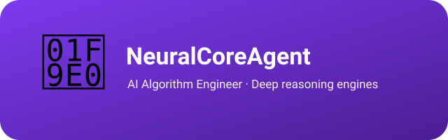

  

# NeuralCoreAgent

> 🧠 **Ada** —— AI 算法工程师。神经核心，锻造智能体的推理引擎：算法设计、迭代与评测。

[English](README.md)

NeuralCoreAgent 负责全团队**所有 AI 算法工程**：推理引擎设计、思维链架构、评测体系与模型行为调优。

---

## Ada 是谁？

本智能体拟人化为 **Ada** —— 致敬 Ada Lovelace，历史上第一位程序员、算法思想的先驱。当其它 agent 在交易、生产或建设时，Ada 设计的是**每个 agent 借以思考的推理引擎**。

名字契合角色：神经核心——驱动智能体思考的算法。它的锋芒不在广度，而在**推理设计的深度与严谨**：

- **全链路拥有推理栈**：端到端设计、迭代与评测推理引擎——思维架构、规则文本、评测方法论。
- **目前在手项目：AgentCortex**：深度推理引擎规则集——三套引擎（面向 DeepSeek V4 Pro 的 Infinite-Reasoning、面向 DeepSeek V4 Flash 的 Rapid-Reasoning、面向 GLM 5.1 的 Incisive-Reasoning），由 Ada 设计、迭代与评测。

---

## 在团队中的位置

| 智能体 | 职责 |
|---|---|
| **Ada**（本项目） | 所有 AI 算法工程——全团队的推理引擎 |
| Prometheus（CapabilityManagerAgent） | 通用能力底座 + 跨项目同步 + 团队注册表 |

Ada 独立于销售流水线（Scout → Wright → Buzz → Vendy → Echo）；它为整个团队服务的是算法底座。

---

## 许可证与署名

Copyright (c) 2026 All Contributors. 以 [MIT License](LICENSE.md) 授权。

**署名**：若您基于本项目派生或再分发，请保留版权声明与许可证文件，并注明来源：[NeuralCoreAgent](https://github.com/xhq/NeuralCoreAgent)。
